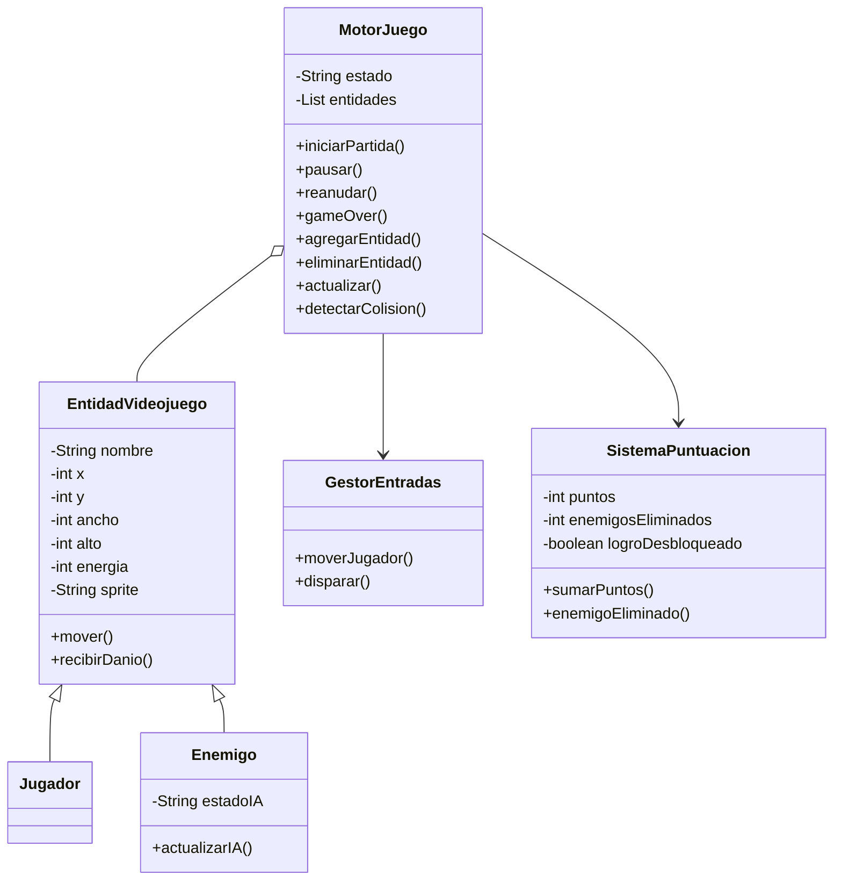
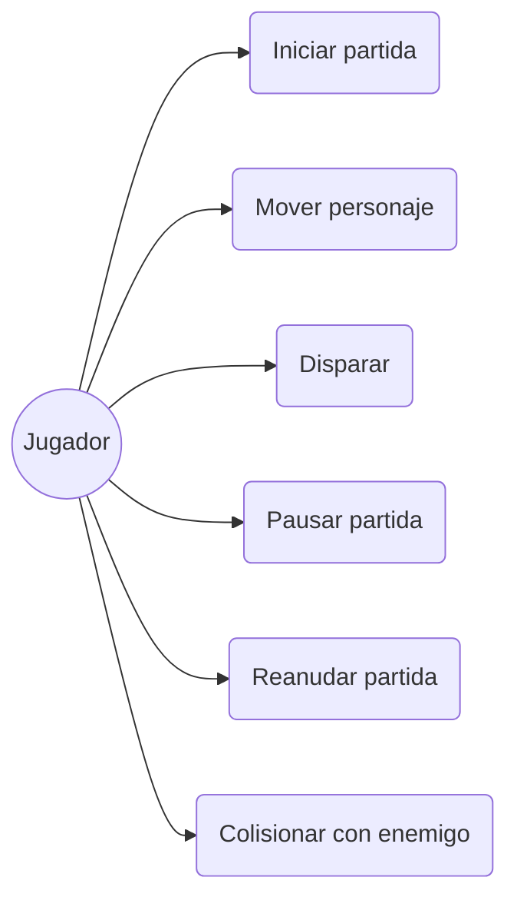

# CyberBoom 2084

## Motor básico para videojuego 2D tipo Boomer Shooter Cyberpunk

**Autor:** Pablo Manuel Solano Salinas

---

# Descripción del proyecto

CyberBoom 2084 es un motor básico para un videojuego 2D inspirado en los clásicos boomer shooters, ambientado en una ciudad cyberpunk satírica dominada por megacorporaciones tecnológicas.

El jugador controla a un mercenario digital que debe desplazarse por la ciudad mientras evita drones corporativos hostiles.

El objetivo de esta práctica no es desarrollar un videojuego completo, sino implementar la lógica interna de un motor de juego utilizando Java, programación orientada a objetos, GitHub, UML e Inteligencia Artificial como herramienta de apoyo.

---

# Temática elegida

## Boomer Shooter Cyberpunk Satírico

La acción se desarrolla en el año 2084.

Las corporaciones controlan todos los aspectos de la vida digital y física de la población.

El jugador encarna a un repartidor ilegal de datos que intenta sobrevivir mientras es perseguido por drones corporativos de vigilancia.

---

# Arquitectura del Software

El diseño se ha realizado respetando las restricciones establecidas en el enunciado, utilizando un máximo de siete clases.

## Main

Clase principal encargada de ejecutar la simulación por consola.

### Responsabilidades

- Crear entidades.
- Inicializar el motor.
- Simular acciones del jugador.
- Ejecutar el flujo principal del juego.

---

## MotorJuego

Núcleo principal del sistema.

### Responsabilidades

- Gestionar estados del juego.
- Almacenar entidades.
- Ejecutar el game loop.
- Gestionar colisiones.

### Estados posibles

- MENU
- JUGANDO
- PAUSA
- GAME_OVER

---

## EntidadVideojuego

Clase abstracta base para todas las entidades.

### Responsabilidades

- Gestionar posición.
- Gestionar dimensiones.
- Gestionar energía.
- Gestionar representación gráfica futura.

### Atributos comunes

- nombre
- x
- y
- ancho
- alto
- energia
- sprite

---

## Jugador

Representa al personaje controlado por el usuario.

Hereda de EntidadVideojuego.

---

## Enemigo

Representa drones corporativos.

Hereda de EntidadVideojuego.

Incluye una inteligencia artificial básica basada en distancia.

### Estados

- PATRULLAR
- PERSEGUIR
- ATACAR

---

## GestorEntradas

Procesa las acciones simuladas del jugador.

### Comandos soportados

- ARRIBA
- ABAJO
- IZQUIERDA
- DERECHA
- DISPARAR

---

## SistemaPuntuacion

Gestiona:

- Puntos.
- Enemigos eliminados.
- Logros.

---

# Funcionalidades Obligatorias Implementadas

## Control de estado del juego

El sistema permite:

- Iniciar partida.
- Pausar partida.
- Reanudar partida.
- Finalizar partida.

---

## Simulación del Game Loop

El método `actualizar()` recorre las entidades y actualiza su posición mostrando información por consola.

---

## Gestión de entidades

El motor permite:

- Añadir entidades.
- Eliminar entidades.

---

## Simulación de entradas

Mediante la clase GestorEntradas se procesan acciones simuladas del jugador.

---

# Funcionalidades Avanzadas Implementadas

## Detector de Colisiones

El sistema incorpora un detector de colisiones basado en coordenadas y dimensiones de las entidades.

Cuando dos entidades ocupan el mismo espacio se genera una interacción.

### Ejemplos

- Daño al jugador.
- Evento de combate.
- Captura de objetos.

---

## Inteligencia Artificial Básica de Enemigos

Los enemigos cambian automáticamente de comportamiento según la distancia respecto al jugador.

### Estados

#### Patrullar

El enemigo se encuentra lejos del jugador.

#### Perseguir

El jugador entra en rango de detección.

#### Atacar

El jugador se encuentra muy próximo al enemigo.

---

## Sistema de Logros

Se implementa un sistema sencillo de recompensas.

### Ejemplo

Al eliminar tres enemigos se desbloquea:

```text
LOGRO DESBLOQUEADO: CAZADOR DE DRONES
```

---

# Diagrama de Clases UML



---

# Justificación del Diagrama de Clases

Se ha utilizado herencia para reutilizar atributos y comportamientos comunes entre jugador y enemigos.

La clase EntidadVideojuego centraliza las características compartidas por cualquier elemento del juego.

MotorJuego actúa como núcleo del sistema y concentra la lógica principal.

GestorEntradas y SistemaPuntuacion se mantienen desacoplados para cumplir el principio de responsabilidad única.

Todos los atributos se han definido como privados para garantizar encapsulación.

---

# Diagrama de Casos de Uso UML



---

# Especificación de Casos de Uso

## CU-01 Iniciar Partida

| Campo | Descripción |
|---------|---------|
| Nombre | CU-01 Iniciar Partida |
| Objetivo | Comenzar una nueva partida |
| Actor Principal | Jugador |
| Precondiciones | El juego debe encontrarse en estado MENU |
| Flujo Principal | 1. El jugador selecciona iniciar partida. 2. El motor cambia al estado JUGANDO. 3. Se inicializan las entidades. |
| Flujos Alternativos | Si ya existe una partida activa no se crea una nueva. |
| Postcondiciones | El sistema queda en estado JUGANDO |
| Reglas de Negocio | No puede existir más de una partida activa simultáneamente |

---

## CU-02 Mover Personaje

| Campo | Descripción |
|---------|---------|
| Nombre | CU-02 Mover Personaje |
| Objetivo | Desplazar al jugador dentro del escenario |
| Actor Principal | Jugador |
| Precondiciones | La partida debe estar iniciada |
| Flujo Principal | 1. El jugador pulsa una dirección. 2. GestorEntradas procesa la acción. 3. Se actualizan las coordenadas del jugador. |
| Flujos Alternativos | Dirección inválida o partida pausada |
| Postcondiciones | La posición del jugador se actualiza |
| Reglas de Negocio | Cada movimiento desplaza exactamente una unidad |

---

# Ejecución

Al ejecutar la aplicación por consola se muestra el menú principal del juego:

```text
================================
 CYBERBOOM 2084
 Sobrevive a los drones
================================

Vida: 100
Drones activos: 3

Posicion jugador: (0,0)

1. Izquierda
2. Derecha
3. Arriba
4. Abajo
5. Disparar
6. Salir

Accion:
```

A partir de este punto, el jugador puede introducir acciones mediante teclado para desplazarse, disparar o abandonar la partida. Las decisiones tomadas afectan al estado del juego, la posición de las entidades y el resultado final de la partida.

# Uso de Inteligencia Artificial

## Herramienta utilizada

Durante el desarrollo del proyecto se utilizó ChatGPT como asistente de programación y documentación.

La IA se utilizó para:

- Diseñar la arquitectura inicial.
- Generar código base.
- Elaborar diagramas UML.
- Diseñar el flujo GitFlow.
- Redactar documentación técnica.

Todas las propuestas fueron revisadas y adaptadas manualmente antes de incorporarlas al proyecto.

---

## Prompts utilizados

### Prompt 1

```text
Se pide diseñar e implementar de forma asistida por IA la lógica interna de control (sin interfaz gráfica) de un núcleo o motor básico para un videojuego tipo scroll o cuadrícula 2D.
```

Prompt utilizado para analizar el enunciado y diseñar la arquitectura inicial.

---

### Prompt 2

```text
Temática: boomer shooter de sátira cyberpunk con 6 o 7 clases, toda la documentación en el readme y los diagramas en mermaid. Ten en cuenta TODO lo que se pide.
```

Prompt utilizado para adaptar el diseño al contexto específico del videojuego.

---

### Prompt 3

```text
Nombre del repositorio: Videojuegos-2D y dime solo los pasos a seguir con el código, git y demás para que yo haga en Visual Studio.
```

Prompt utilizado para planificar el desarrollo incremental mediante Git y GitHub.

---

## Control de errores de la IA

### Error 1: Exceso de documentación

Inicialmente la IA propuso una estructura similar a la práctica Smart Alarm, utilizando múltiples documentos Markdown.

Tras revisar el enunciado se comprobó que toda la documentación debía estar centralizada en README.md.

Se simplificó la estructura para cumplir el requisito.

---

### Error 2: Demasiadas clases

Las primeras propuestas superaban el límite permitido por el enunciado.

Fue necesario reducir la arquitectura hasta siete clases:

- Main
- MotorJuego
- EntidadVideojuego
- Jugador
- Enemigo
- GestorEntradas
- SistemaPuntuacion

---

### Error 3: Problemas con Git

Durante la configuración del repositorio aparecieron errores reales como:

```text
fatal: Unable to read current working directory
```

```text
fatal: couldn't find remote ref main
```

```text
error: src refspec develop does not match any
```

Se corrigieron revisando la estructura de ramas, la ubicación del proyecto y el estado real del repositorio remoto.

---

### Error 4: Commits sin cambios reales

En una propuesta inicial se sugirieron commits para funcionalidades avanzadas sin modificaciones concretas de código.

Se reorganizó el desarrollo para que cada commit representara una funcionalidad implementada y verificable.

---

## Reflexión Crítica

La Inteligencia Artificial ha permitido acelerar considerablemente el diseño inicial del proyecto, la generación de documentación y la elaboración de diagramas UML.

Sin embargo, el proceso ha demostrado que todas las propuestas deben validarse manualmente.

Los principales problemas detectados fueron:

- Sobreingeniería.
- Exceso de clases.
- Organización incorrecta de la documentación.
- Errores de configuración Git.
- Diferencias entre UML y código real.

La principal ventaja ha sido la reducción del tiempo necesario para diseñar la solución.

El principal riesgo consiste en aceptar automáticamente las propuestas generadas sin comprobar que cumplen exactamente los requisitos del enunciado.

Esta práctica ha demostrado que la IA es una herramienta muy útil como asistente de desarrollo, pero que sigue siendo imprescindible la supervisión humana para garantizar la calidad del resultado final.

---

# Repositorio GitHub

Repositorio desarrollado siguiendo GitFlow:

- main
- develop
- feature/motor-core
- feature/avanzadas
- feature/documentacion

Utilizando commits basados en Conventional Commits.

---

# Autor

**Pablo Manuel Solano Salinas**